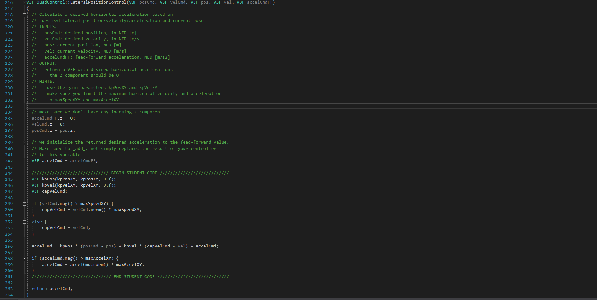

# FCND - Control of a 3D Quadrotor

## Writeup / README

### 1. Provide a Writeup / README that includes all the rubric points and how you addressed each one.  You can submit your writeup as markdown or pdf

You're reading it! Below I describe how I addressed each rubric point and where in my code each point is handled.

### Implemented Controller

#### 1. Implemented body rate control in C++.

##### The controller should be a proportional controller on body rates to commanded moments. The controller should take into account the moments of inertia of the drone when calculating the commanded moments.

As seen below is the implementation of the body rate control.


#### 2. Implement roll pitch control in C++.

##### The controller should use the acceleration and thrust commands, in addition to the vehicle attitude to output a body rate command. The controller should account for the non-linear transformation from local accelerations to body rates. Note that the drone's mass should be accounted for when calculating the target angles.

As seen below is the implementation of the roll pitch.


#### 3. Implement altitude controller in C++.

##### The controller should use both the down position and the down velocity to command thrust. Ensure that the output value is indeed thrust (the drone's mass needs to be accounted for) and that the thrust includes the non-linear effects from non-zero roll/pitch angles

##### Additionally, the C++ altitude controller should contain an integrator to handle the weight non-idealities presented in scenario 4

As seen below is the implementation of the altitude controller.


#### 4. Implement lateral position control in C++.

##### The controller should use the local NE position and velocity to generate a commanded local acceleration.

As seen below is the implementation of the lateral position control.



#### 5. Implement yaw control in C++.

##### The controller can be a linear/proportional heading controller to yaw rate commands (non-linear transformation not required).

As seen below is the implementation of the Yaw control.


#### 6. Implement calculating the motor commands given commanded thrust and moments in C++.

##### The thrust and moments should be converted to the appropriate 4 different desired thrust forces for the moments. Ensure that the dimensions of the drone are properly accounted for when calculating thrust from moments.

As seen below is the implementation of the calculation of motor commmand.


### Flight Evaluation

#### 1. Your C++ controller is successfully able to fly the provided test trajectory and visually passes inspection of the scenarios leading up to the test trajectory.

##### Ensure that in each scenario the drone looks stable and performs the required task. Specifically check that the student's controller is able to handle the non-linearities of scenario 4 (all three drones in the scenario should be able to perform the required task with the same control gains used).

Here is the result of the scenarios

## Scenario 1

```PASS: ABS(Quad.PosFollowErr) was less than 0.500000 for at least 0.800000 seconds```


## Scenario 2

```PASS: ABS(Quad.Roll) was less than 0.025000 for at least 0.750000 seconds```

```PASS: ABS(Quad.Omega.X) was less than 2.500000 for at least 0.750000 seconds```


## Scenario 3

```PASS: ABS(Quad1.Pos.X) was less than 0.100000 for at least 1.250000 seconds```

```PASS: ABS(Quad2.Pos.X) was less than 0.100000 for at least 1.250000 seconds```

```PASS: ABS(Quad2.Yaw) was less than 0.100000 for at least 1.000000 seconds```


## Scenario 4

```PASS: ABS(Quad1.PosFollowErr) was less than 0.100000 for at least 1.500000 seconds```

```PASS: ABS(Quad2.PosFollowErr) was less than 0.100000 for at least 1.500000 seconds```

```PASS: ABS(Quad3.PosFollowErr) was less than 0.100000 for at least 1.500000 seconds```


## Scenario 5

```PASS: ABS(Quad2.PosFollowErr) was less than 0.250000 for at least 3.000000 seconds```


## Extra Challenge

## Challenge 1

```result```


## Challenge 2

```PASS: ABS(Quad2.PosFollowErr) was less than 0.250000 for at least 3.000000 seconds```


